# Service Fabric (Containers) - Hands-on Lab Script

Mark Harrison : 1 Dec 2017, updated 5 April 2018


## Overview

Service Fabric is a distributed systems platform that makes it easy to package, deploy, and manage scalable and reliable microservices and containers. Developers and administrators can avoid complex infrastructure problems and focus on implementing mission-critical, demanding workloads that are scalable, reliable, and manageable.

In this Lab, we will deploy  a Web App to Service Fabric using a Docker container.

## Create SF cluster

### Option 1

Party clusters are free, limited-time Service Fabric clusters hosted on Azure and run by the Service Fabric team where anyone can deploy applications and learn about the platform.

A party cluster will only last for one hour - but it will be immediately available.

- Access the following URL

<http://aka.ms/tryservicefabric>

- Logon with GitHub or Facebook


- Select the option to Join a Windows Cluster


### Option2

Alternatively, create a Service Fabric cluster in Azure using the Azure Management portal.

This option will take some time to provision, as it needs to provision a VM scale set with 5 nodes.  The advantage over party clusters is it will not disappear after one hour.

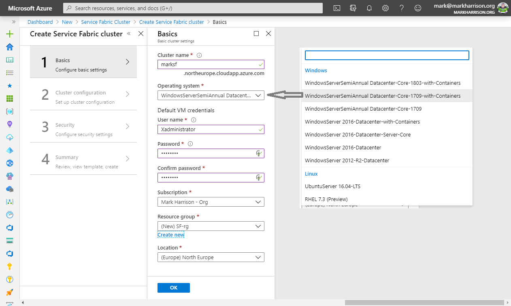

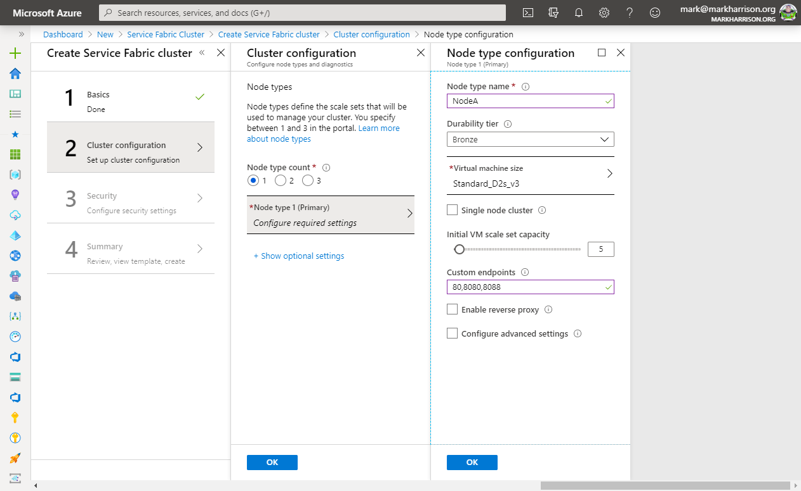

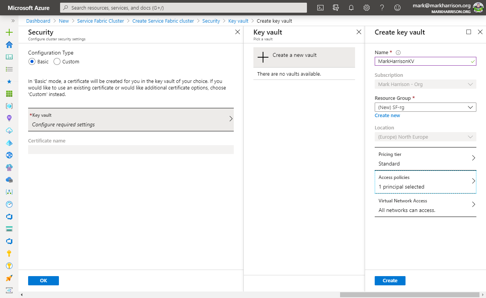

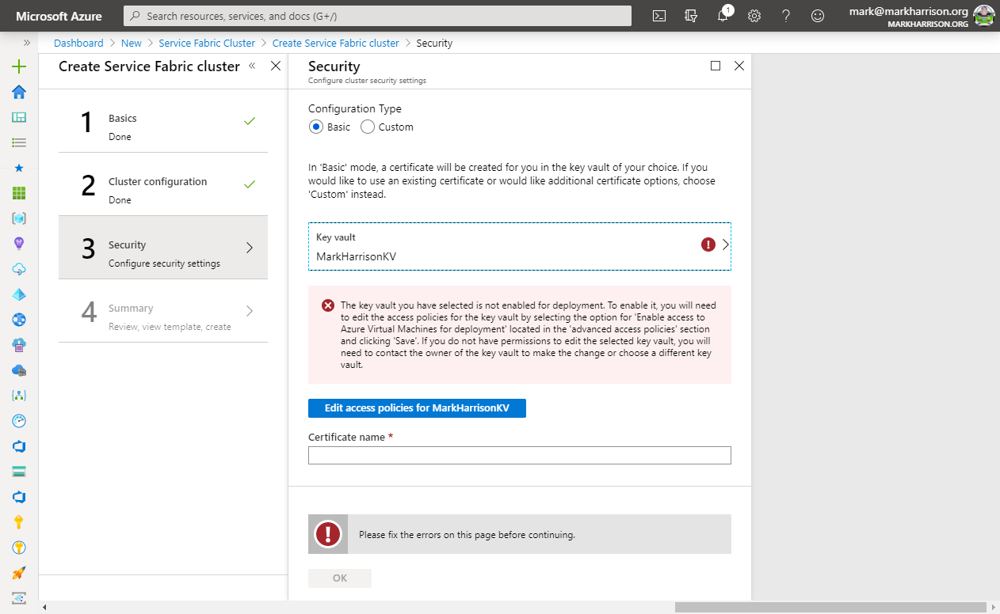

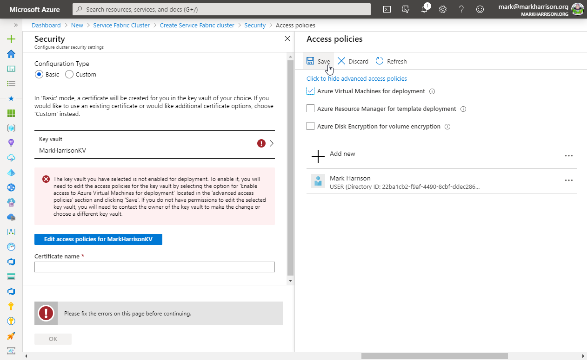

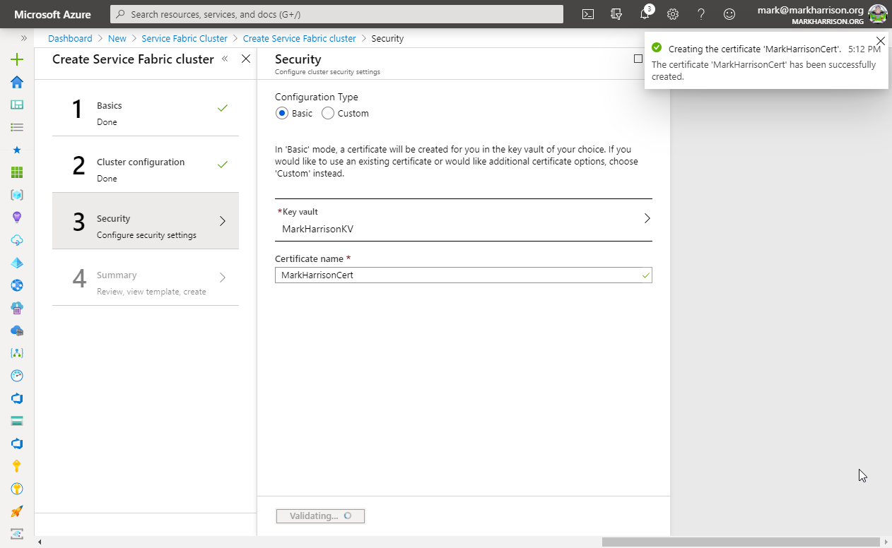

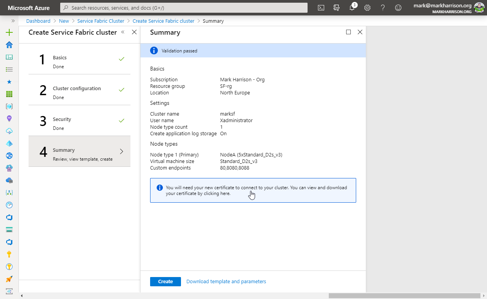


## Secure Connectivity

The cluster uses a single self-signed certificate for client to node security (also for node to node communication). The certificate generated during the provision cluster must be installed in the ```CurrentUser\My``` certificate store.

For Option 1 (the Party Cluster) - there is a link giving the PowerShell required to install the certificate.

For Option 2, as part of the provisioing screens there is a link to download the certificate.  This can be installed with the following PowerShell (amend filename appropriately) or via the MMC console app.

```powershell
$pswd = "1234"
$pfxfilepath = "C:\Users\mharriso\Desktop\markharrisonkv-MarkHarrisonCert-20180404.pfx"

Import-PfxCertificate -Exportable -CertStoreLocation Cert:\LocalMachine\My `
 -FilePath $PfxFilePath -Password (ConvertTo-SecureString -String $pswd -AsPlainText -Force)
```

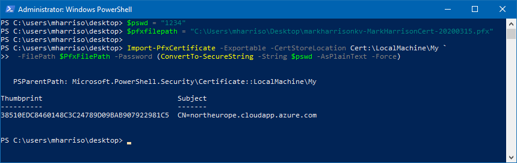

Take note of the certificate thumbprint - this will be needed when publishing from Visual Studio.

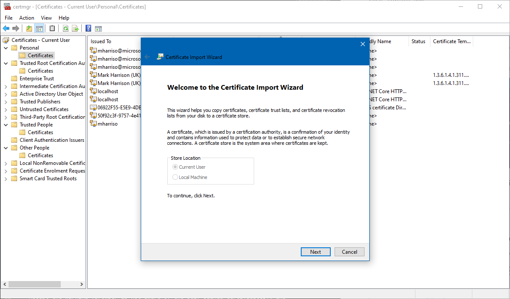

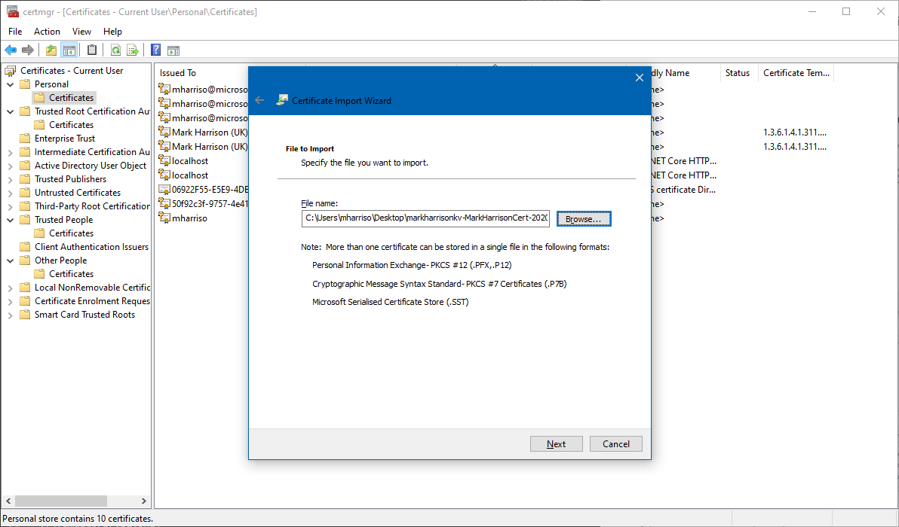


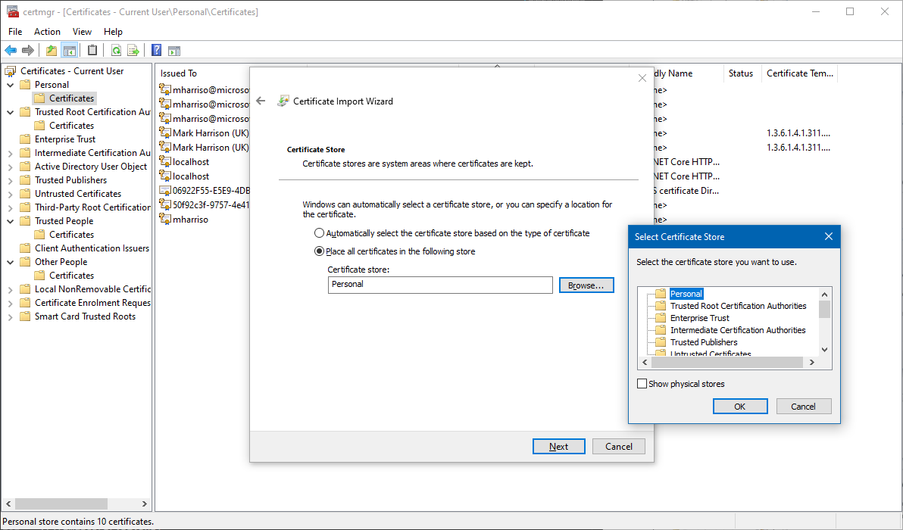

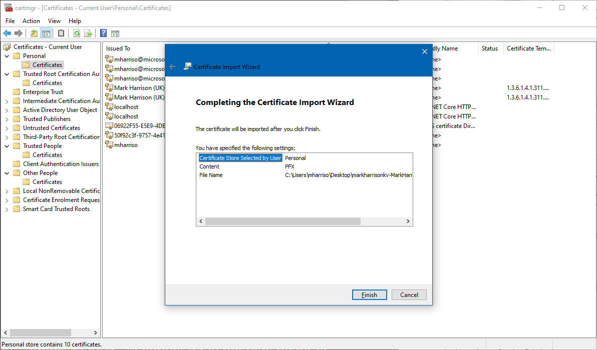

## SF Explorer

Service Fabric Explorer is a web-based tool for inspecting and managing applications and nodes in an Azure Service Fabric cluster.

- To reach Service Fabric Explorer, navigate to the Service Fabric connection endpoint - in the above example it would be  <https://marksf.westeurope.cloudapp.azure.com:19080/Explorer> - amend appropriately based on the name given to your cluster
- Accept the warning (browser is not aware of the self signed certificates), and continue to the webpage.
- Specify the certificate that was downloaded / installed. 

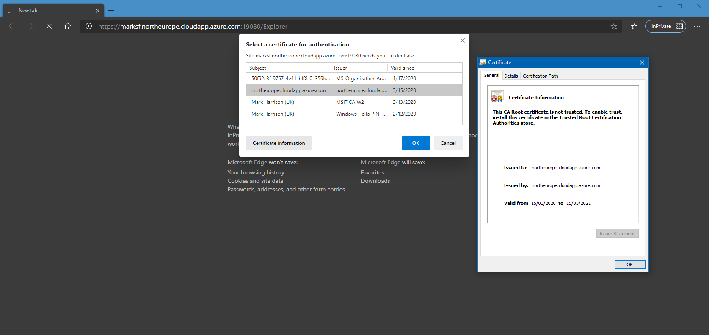

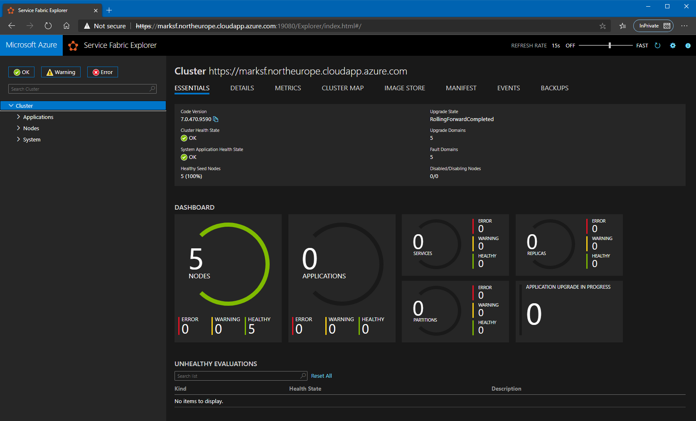

## Create SF deployment files

We shall use a Visual Studio project to create the deployment files.

- From the Visual Studio menu, create a new Project
- Select Service Fabric Application

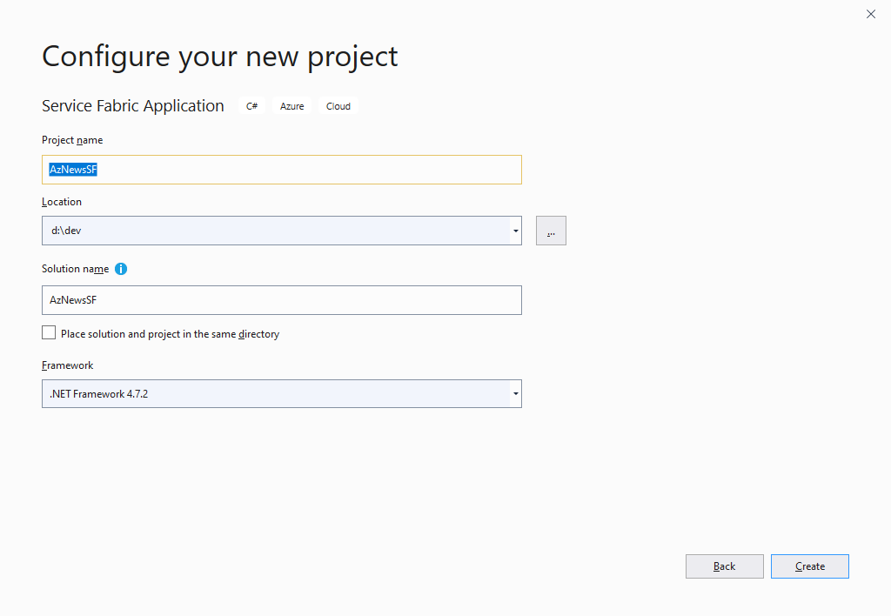

- Select Container as the Service Template
- Specify image name e.g. markharrison/aznewswindows:grey
- Specify service name e.g. aznews


This will generate ApplicationManifest.xml and ServiceManifest.xml

ApplicationManifest.xml - The application manifest declaratively describes the application type and version. It specifies service composition metadata such as stable names, partitioning scheme, instance count/replication factor, security/isolation policy, placement constraints, configuration overrides, and constituent service types.

ServiceManifest.xml - The service manifest declaratively defines the service type and version. It specifies service metadata such as service type, health properties, load-balancing metrics, service binaries, and configuration files.

Notice that the container image is specified in ServiceFabric.xml

```xml
    <EntryPoint>
      <ContainerHost>
        <ImageName>markharrison/aznewswindows:grey</ImageName>
      </ContainerHost>
    </EntryPoint>
```

- Add the following to the end of ServiceManifest.xml

```xml
  <Resources>
    <Endpoints>
      <Endpoint Name="aznewsTypeEndpoint" UriScheme="http" Port="80" Protocol="http"/>
    </Endpoints>
  </Resources>

  </ServiceManifest>
```

- Add the following to ApplicationManifest.xml within the   `<ServiceManifestImport>` tag

```xml
    <ConfigOverrides />
    <Policies>
        <ContainerHostPolicies CodePackageRef="Code" >
        <PortBinding ContainerPort="80" EndpointRef="aznewsTypeEndpoint"/>
      </ContainerHostPolicies>
      <ServicePackageResourceGovernancePolicy CpuCores="0"/>
      <ResourceGovernancePolicy CodePackageRef="Code" MemoryInMB="1024"  />
    </Policies>
```

If using a private container registry, then will need to specify the respository credentials.

```xml
      <ContainerHostPolicies CodePackageRef="Code" >
        <RepositoryCredentials AccountName="markharrison" Password="password" PasswordEncrypted="false"/>

      </ContainerHostPolicies>
```

## Deployment

- In the Visual Studio Solution Explorer, right click on project name and select Publish
- Specify the Service Fabric connection endpoint - this will be on port 19000
- Specify the certificate details 
- Select Publish

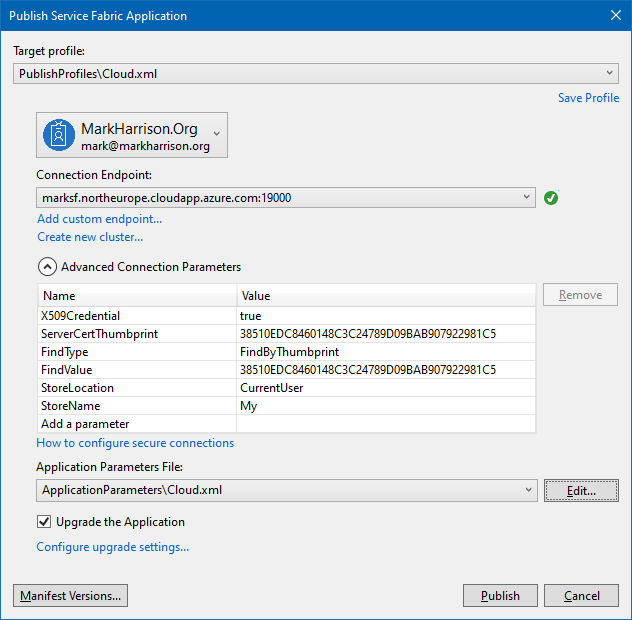

The certificate details are stored in ```cloud.xml```

```xml
  <ClusterConnectionParameters ConnectionEndpoint="marksf.westeurope.cloudapp.azure.com:19000"
                             X509Credential="true"
                             ServerCertThumbprint="024b89a2d21c63a7b583c89fb0b7590692efce21"
                             FindType="FindByThumbprint"
                             FindValue="024b89a2d21c63a7b583c89fb0b7590692efce21"
                             StoreLocation="CurrentUser"
                             StoreName="My" />
```

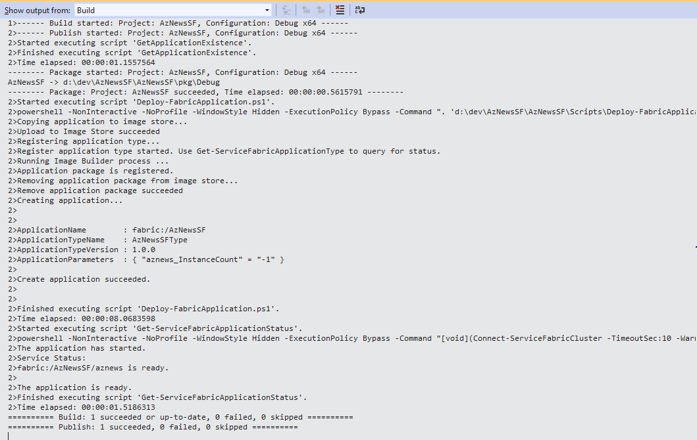

The Service Fabric Explorer will show that 1 Application has been deployed

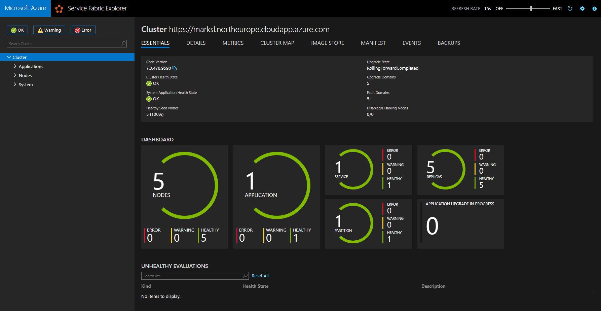

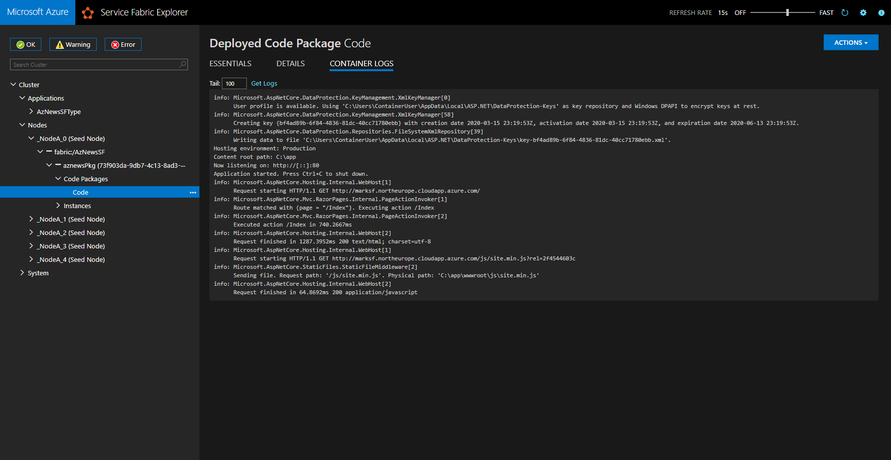

We can now access our web application

- Use web browser to navigate to the Service Fabric cluster address - port 80

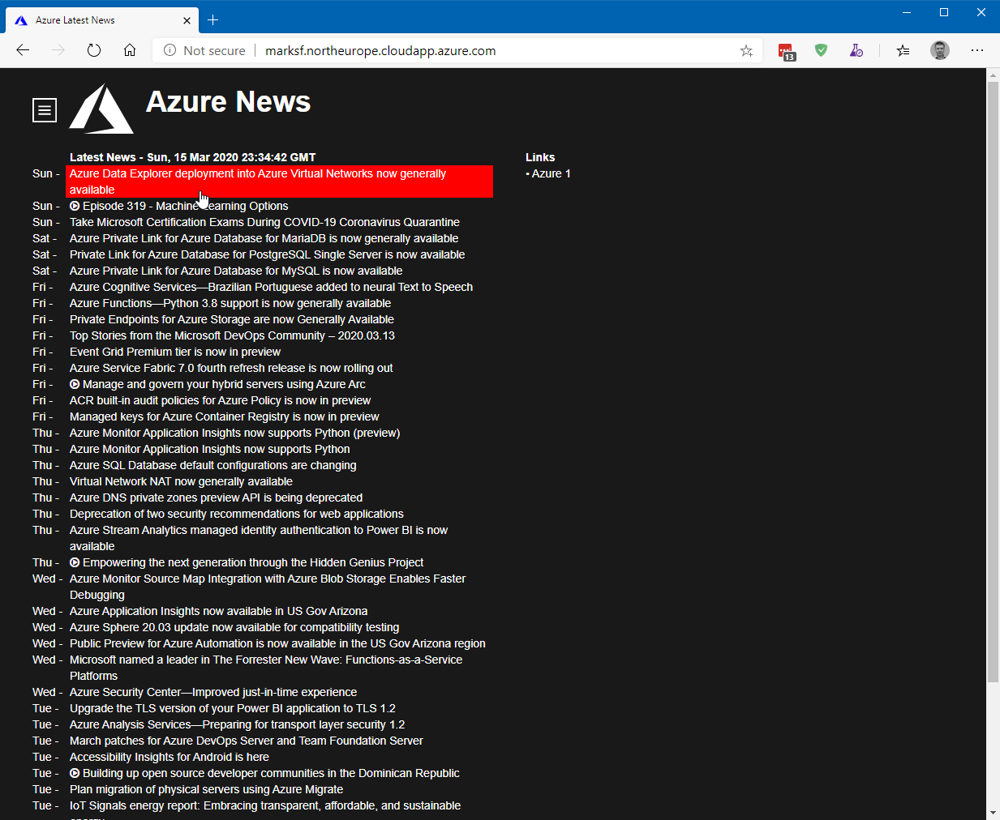

## Update Application

We shall now change the business logic in our container, and deploy an updated version.

Amend the container image specified in ServiceFabric.xml

```xml
    <EntryPoint>
      <ContainerHost>
        <ImageName>markharrison/aznewswindows:blue</ImageName>
      </ContainerHost>
    </EntryPoint>
```

As before, publish the application from within Visual Studio.

- Select the [Upgrade the Application] checkbox
- Select the [Manifest Versions] button, and upgrade the version numbers
- Publish the application

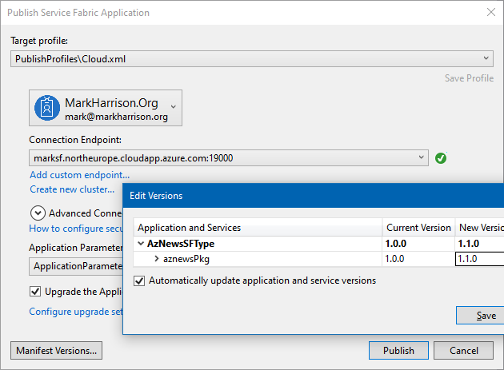

In the Servic Fabric Explorer, we can see the state of the upgrade being rolled out across the cluster nodes.  The web app remains available whilst the upgrade is being deployed.

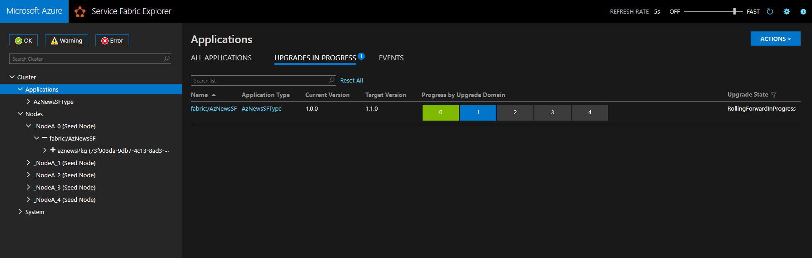


We can now access our updated web application

- Use web browser to navigate to the Service Fabric cluster address - port 80

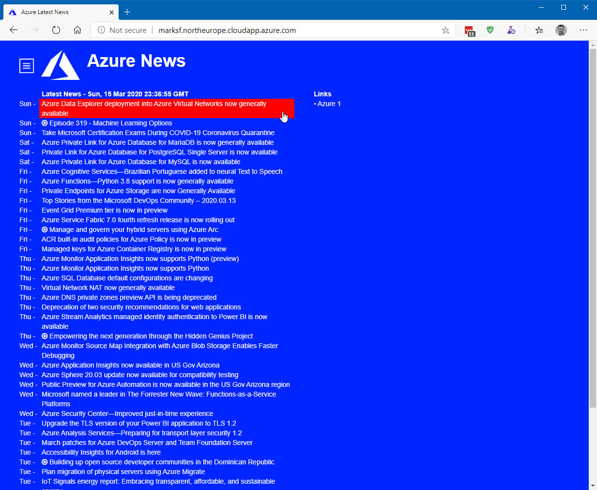

The new Blue version of the web app is now live.

## Tidy up

If a Party Cluster was used - then it will be deleted automatically after one hour.

If a SF cluster in Azure was used - either:

- delete the Resource Group to wipe the cluster permanently
- stop the VM instances in the VM Scale Set to prevent compute costs - they can be restarted again, when required.

---
<http://github.markharrison.io>